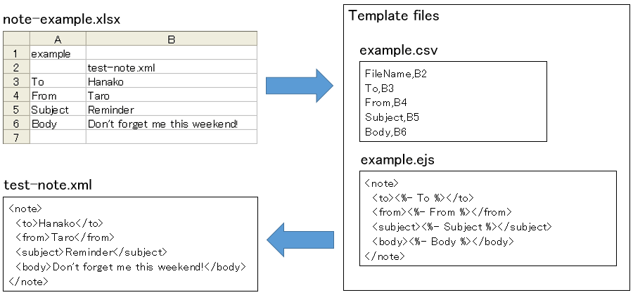
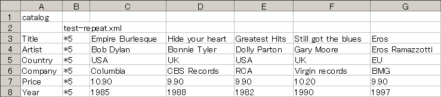
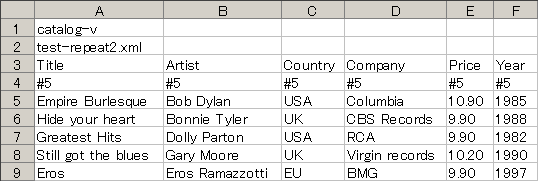

# autometa [![NPM version][npm-image]][npm-url] [![Build Status][travis-image]][travis-url]

Generate various data from Excel spreadsheet.

## Overview

1. Extract "A1" cell value as "Template ID" from each Excel worksheet
2. Extract all cells value according to [Template ID].csv
3. Embed these values into [Template ID].ejs
4. Save as FileName specified in an Excel worksheet

## Installation

via [npm (node package manager)](http://github.com/isaacs/npm)

    $ npm install -g autometa

## Examples

### Basic example

Generate data from note-example.xlsx as mentioned in the overview above.

    $ autometa note-example.xlsx

### Horizontal repetitive elements example

Generate data from Excel spreadsheet includes an element repeated horizontally.

    $ autometa test-repeat.xlsx

test-repeat.xlsx

catalog.csv

    FileName,B2
    Title,B3
    Artist,B4
    Country,B5
    Company,B6
    Price,B7
    Year,B8

catalog.ejs

    <CATALOG>
    <% for (i=0; i<Title.length; i++) { -%>
      <CD>
        <TITLE><%- Title[i] %></TITLE>
        <ARTIST><%- Artist[i] %></ARTIST>
        <COUNTRY><%- Country[i] %></COUNTRY>
        <COMPANY><%- Company[i] %></COMPANY>
        <PRICE><%- Price[i] %></PRICE>
        <YEAR><%- Year[i] %></YEAR>
      </CD>
    <% } -%>
    </CATALOG>

### Vertical repetitive elements example

Generate data from Excel spreadsheet includes an element repeated vertically.

test-repeat2.xlsx

catalog-v.csv

    FileName,A2
    Title,A4
    Artist,B4
    Country,C4
    Company,D4
    Price,E4
    Year,F4

catalog-v.ejs (same as catalog.ejs)

    <CATALOG>
    <% for (i=0; i<Title.length; i++) { -%>
      <CD>
        <TITLE><%- Title[i] %></TITLE>
        <ARTIST><%- Artist[i] %></ARTIST>
        <COUNTRY><%- Country[i] %></COUNTRY>
        <COMPANY><%- Company[i] %></COMPANY>
        <PRICE><%- Price[i] %></PRICE>
        <YEAR><%- Year[i] %></YEAR>
      </CD>
    <% } -%>
    </CATALOG>

### Horizontal and vertical repetitive elements

Of course, you can generate data from Excel spreadsheet includes elements repeated horizontally and vertically.

## Multiple worksheets

You can get data from each worksheet of Excel spreadsheets.

## Templates directory

Autometa search templates ([Template ID].csv and [Template ID].ejs) in the current directory of input file first.
If templates not found, search default templates directory ([autometa package directory]/templates).
If you want to add templates directory, set AUTOMETA_TEMPLATES environment variable.

    $ export AUTOMETA_TEMPLATES="/path/to/your/templates"

## Original Templates

If you want to define original templates, create [Template ID].csv, [Template ID].ejs and place these files in the templates directory. 

You can also place templates by register option (-r or --register).

    $ autometa -r [Template ID].ejs [Template ID].csv
    $ Register success: [Template ID].ejs placed on [templates directory]
    $ Register success: [Template ID].csv placed on [templates directory]

## Set a filename manually

If you want to set a filename of first sheet manually, use `-o, --output` option.

    $ autometa -o /path/to/your/filename note-example.xlsx

If specified filename is "/dev/stdout" or "-", autometa place output on stdout.

    $ autometa -o /dev/stdout note-example.xlsx

When you use this option, Excel worksheet's FileName is ignored.

## Set a Template ID manually

If you want to set a Template ID manually, use `-t, --template` option.

    $ autometa -t your-template-id note-example.xlsx

When you set this option, Excel worksheet's Template ID is ignored.

## Usage manual

    $ autometa -h
      Usage: autometa [options] <Excel spreadsheet>

      Options:

        -h, --help                      output usage information
        -v, --version                   output the version number
        -f, --force                     overwrite existing files
        -p, --print-templates-dirs      print templates direcotries
        -o, --output                    set output file name of first sheet manually
        -r, --register <template file>  register templates
        -t, --template <Template ID>    set a Template ID manually
    
    Environment variable:
    AUTOMETA_TEMPLATES         Set ":"-separeted list of directories,
                               if you want to change templates directory.

## Dependencies

commander, ect, ejs, xlsjs, xlsx

## References

Example data in reference to [XML Examples]

## Notes

Segmentation faults in node v0.10.31 stem from a bug in node.
Autometa will throw an error if it is running under that version.
Since versions prior to v0.10.30 do not exhibit the problem,
rolling back to a previous version of node is the best remedy.
See <https://github.com/joyent/node/issues/8208> for more information.

## License

Copyright &copy; 2014 [Kenji Doi (knjcode)](https://github.com/knjcode)  
Licensed under the [Apache License, Version 2.0][Apache]

[npm-url]: https://npmjs.org/package/autometa
[npm-image]: https://badge.fury.io/js/autometa.svg
[travis-url]: https://travis-ci.org/knjcode/autometa
[travis-image]: https://travis-ci.org/knjcode/autometa.svg?branch=master
[Apache]: http://www.apache.org/licenses/LICENSE-2.0
[XML Examples]: http://www.w3schools.com/xml/xml_examples.asp
